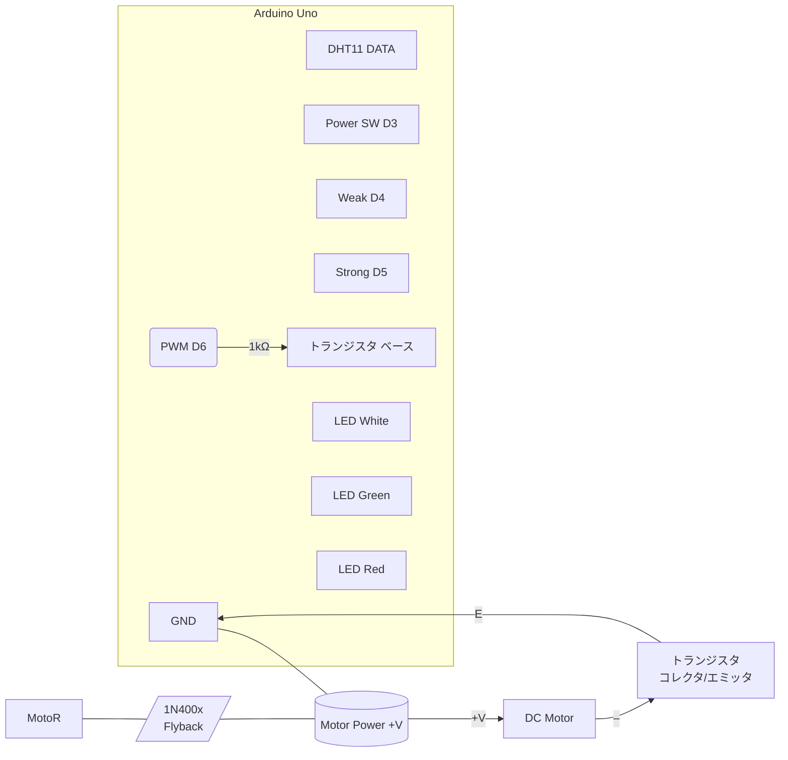

# 組み立て図：DHT11 を含む配線（ブレッドボード向け）

以下は、ELEGOO のチュートリアル風（見やすいステップ式）にした配線図です。Arduino Uno / Nano とブレッドボードを使って組み立てる想定です。

## コンポーネント
## コンポーネント（Arduino チュートリアル準拠）
以下は Arduino / ELEGOO 入門チュートリアルで扱う定番パーツを本プロジェクト用に数量まで明記した一覧です。

- /Arduino Uno または Nano: 1 個
- /DHT11 温湿度センサー モジュール: 1 個
- /プッシュボタン（スイッチ）: 3 個（Power / WEAK / STRONG）
- /トランジスタ（NPN、低側スイッチ用途）: 1 個
c:\\配電図 / Wiring & Power Distribution

このドキュメントは、詳細設計書と Arduino チュートリアル（Uno/ELEGOO 互換のピン配置）に合わせた配電図と配線要点をまとめたものです。

**目的**: Arduino（ATmega328P 互換）を利用して DHT11、ボタン、LED、トランジスタ（低側スイッチ）経由で DC モーターを駆動する際の電源分配と配線上の注意点を明確にする。

**前提**:
- MCU（Arduino Uno）5V はセンサ・ロジック用。モーターは分離した外部電源（推奨 5–12V、モーター仕様に合わせる）を使用。常に Arduino GND と外部電源の GND を共通にすること。

## コンポーネント要約
- Arduino Uno (5V ロジック)
- DHT11 温度センサ
- トランジスタ (NPN, ベースを PWM で駆動する用途に適したもの)
- DC モーター（適切な動作電圧）
- フライバックダイオード（1N400x または ショットキー 1N5819）
- ゲート直列抵抗 100Ω
- ゲートプルダウン 10kΩ
- 抵抗類（LED 用 330Ω など）
- 3 x 押しボタン（GND に接続するタイプ、内部プルアップ使用）

## 電源分配（要点）
- Arduino 5V はセンサ（DHT11）と LED、ボタンのロジックに使用する。
- モーターは外部電源の +V（例 6V）に接続。モーターの -（マイナス）はトランジスタのコレクタを介して GND に落とす。
- 外部電源の GND を Arduino の GND に必ず接続する（共通 GND）。
- モーターは誘導性負荷のため、フライバックダイオードをモーターに並列（逆向き）に接続する。カソード（線付き）を +V、アノードをトランジスタ側（コレクタ/モーター- 側）に接続。

## 推奨配線（ピン・電源対応）

- DHT11 DATA -> Arduino D2 (内部プルアップではなく 4.7k–10k の外部プルアップを推奨)
- Power（手動/自動切替, SW） -> Arduino D3 (INPUT_PULLUP)
- Weak button -> Arduino D4 (INPUT_PULLUP)
- Strong button -> Arduino D5 (INPUT_PULLUP)
 - トランジスタのベース -> Arduino D6 〜 1kΩ（ベース抵抗）〜 ベース
  - ベース と GND 間に 100kΩ 程度のプルダウン（浮遊防止）
  - トランジスタのコレクタ -> モーター -
  - モーター + -> 外部電源 +V
  - トランジスタのエミッタ -> GND (共通)
- LEDs
  - 白 LED -> D13 (PB5)（電源ON 表示、330Ω）
  - 緑 LED -> A0 (PC0)（弱動作、330Ω）
  - 赤 LED -> A1 (PC1)（強動作、330Ω）

## 回路図（簡易、Mermaid）

## 配線チェックリスト（安全）
1. 電源を切った状態で配線を確認する。
2. モーターの + が外部電源の + に直接つながっていること、モーターの - がトランジスタのコレクタに接続されていることを確認する。
3. トランジスタのピン配列（B/C/E）を部品データシートで確認する（TO-220/TO-126 等で向きが異なる場合あり）。
4. ベースに 1kΩ（ベース抵抗）、ベース→GND に 100kΩ 程度のプルダウンを入れていることを確認。
5. フライバックダイオードはモーターに並列で、カソードを +V、アノードをトランジスタ側に接続する。
6. Arduino の GND と外部電源の GND を必ず共通化する。

## Arduino チュートリアル準拠メモ
- ボタンは Arduino の `INPUT_PULLUP` を使う場合、片側を GND に接続する（押下で LOW になる）。チュートリアルの接続図に従ってください。
- PWM は Arduino の PWM 対応ピン（D3,D5,D6,D9,D10,D11）を使用します。ここでは `D6` を選定しています。
- DHT11 は 3.3–5V ロジックで動作します。チュートリアル通りに 4.7k–10k のプルアップを DATA ラインに入れると安定します。

## よくある誤りと対策（短く）
 - トランジスタを高側スイッチとして誤接続すると動作不良や常時 ON の原因になる。必ず低側スイッチ（モーターのマイナス側）に配置する。
 - ベースの未接続（浮遊）やプルダウン忘れ → ベースがノイズで ON になりうる。ベース抵抗とプルダウンの追加を推奨。
 - フライバックダイオード未接続 → トランジスタや MCU を損傷する可能性。

---
必要であれば、この配電図を基に実際のブレッドボード配線手順（写真つき）と PNG/PDF 図を生成します。どちらを先に希望しますか？
